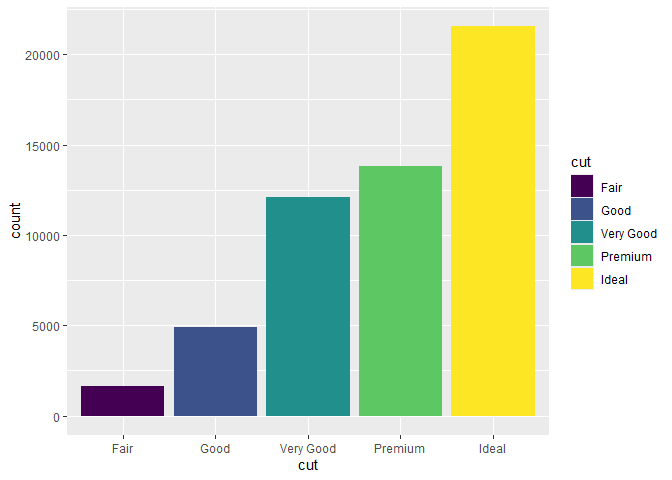

READMe
================

# Practice_1

We are going to do a simple exercise using the mpg data from the ggplot2
library to test run the working of GitHuB

Thinking process

1.  I need to install the packages required using pacman in this case
    the tidyverse and ggplot2
2.  Then call the mpg dataset from the ggplot2 package
3.  I will experiment with a simple visual

``` r
library(pacman)
source("code/prac1.R")
print(dimcolor)
```

<!-- -->
